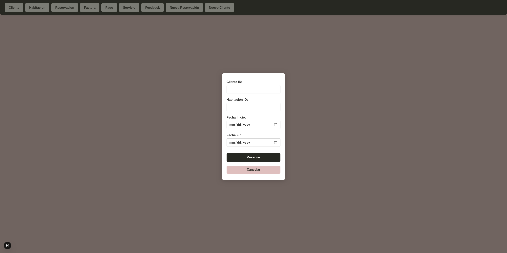

Proyecto de un manejador de hotel usando una base de datos en MYSQL y Next.js





## Comenzando

Correr el servidor de desarrollo usando el siguiente comando:

```bash
npm run dev
# or
yarn dev
# or
pnpm dev
# or
bun dev
```

Abre [http://localhost:3000](http://localhost:3000) en tu navegador para ver el resultado.
